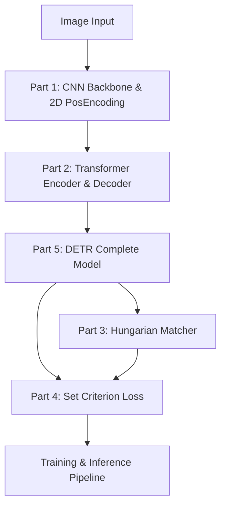

# Hướng Dẫn Code Lại DETR (Detection Transformer) Từ Đầu 🚀

Chào mừng bạn đến với loạt bài hướng dẫn tự tay xây dựng (from scratch) mô hình **DETR (DEtection TRansformer)** - một trong những bước ngoặt lớn nhất của thị giác máy tính, kết hợp giữa CNN và Transformer để giải quyết bài toán Object Detection mà không cần đến các thành phần thủ công như NMS (Non-Maximum Suppression) hay Anchor Boxes.

Loạt bài hướng dẫn này được thiết kế theo hướng **step-by-step (từng bước một)**, viết bằng **PyTorch** và hoàn toàn **không sử dụng** các thư viện framework hỗ trợ tầng cao (như Hugging Face `transformers` hay `detectron2`). Chúng ta sẽ tự tay code từng module, từng dòng code để hiểu sâu sắc nhất cơ chế hoạt động bên trong của mô hình.

---

## 🎯 Mục Tiêu Lộ Trình

Qua chuỗi bài học này, bạn sẽ tự xây dựng hoàn chỉnh:
1. **Backbone CNN & 2D Positional Encoding**: Trích xuất đặc trưng không gian và mã hóa vị trí 2 chiều.
2. **Transformer Encoder & Decoder**: Xây dựng cơ chế Multi-Head Attention, Self-Attention và Cross-Attention.
3. **Hungarian Matcher**: Thuật toán khớp cặp song phương (Bipartite Matching) giải quyết bài toán gán nhãn tối ưu bằng thuật toán Hungary (`scipy.optimize.linear_sum_assignment`).
4. **Bipartite Matching Loss (Set Criterion)**: Thiết lập hàm mất mát bao gồm Classification Loss, L1 Bounding Box Loss và GIoU (Generalized IoU) Loss.
5. **Mô hình DETR hoàn chỉnh & Pipeline Huấn luyện**: Lắp ghép tất cả các phần lại với nhau thành một hệ thống huấn luyện và dự đoán hoạt động hoàn hảo.

---

## 🗺️ Bản Đồ Loạt Bài Hướng Dẫn

Loạt bài học được chia thành 5 phần tương ứng với các thành phần cốt lõi của kiến trúc DETR:



### 📋 Danh sách các phần hướng dẫn chi tiết:

1. **[Phần 1: CNN Backbone & 2D Spatial Positional Encoding](docs/part1_backbone_positional_encoding.md)**
   * Tìm hiểu cách trích xuất feature maps từ ResNet.
   * Xây dựng cơ chế mã hóa vị trí 2D dạng hình sin (Sine/Cosine 2D Positional Encoding) phù hợp với cấu trúc dạng lưới (grid) của ảnh.
   
2. **[Phần 2: Custom Transformer từ đầu](docs/part2_transformer.md)**
   * Implement lớp `MultiHeadAttention` từ các phép toán nhân ma trận cơ bản.
   * Xây dựng `TransformerEncoder` và `TransformerDecoder` dạng mô-đun hóa độc lập.
   * Hiểu rõ vai trò của Object Queries (các truy vấn đối tượng) và cơ chế Attention tương tác giữa chúng với đặc trưng ảnh.

3. **[Phần 3: Thuật Toán Khớp Cặp Hungarian Matcher](docs/part3_hungarian_matcher.md)**
   * Khái niệm Bipartite Matching trong Object Detection: Tại sao không cần Anchor hay NMS?
   * Tính toán Cost Matrix (Ma trận chi phí) kết hợp giữa xác suất phân lớp, khoảng cách $L_1$ và chỉ số $GIoU$.
   * Sử dụng thuật toán Hungary để tìm liên kết tối ưu $1$-đối-$1$.

4. **[Phần 4: Thiết Kế Hàm Mất Mát Set Criterion](docs/part4_loss_criterion.md)**
   * Xây dựng hàm mất mát kết hợp đa nhiệm (Multi-task Loss).
   * Đi sâu vào toán học và cài đặt code cho **GIoU Loss** (Generalized Intersection over Union).
   * Xây dựng lớp `SetCriterion` quản lý việc tính toán lỗi phân lớp và lỗi tọa độ hộp.

5. **[Phần 5: Lắp Ráp Mô Hình DETR & Pipeline Huấn Luyện](docs/part5_detr_model_and_training.md)**
   * Lắp ráp toàn bộ các module thành class `DETR` hoàn chỉnh.
   * Xây dựng pipeline xử lý dữ liệu (Dataset, DataLoader), vòng lặp huấn luyện (Training loop) cơ bản và visualize kết quả dự đoán (Inference).

---

## 🛠️ Yêu Cầu Hệ Thống & Thư Viện

Chúng ta chỉ sử dụng các thư viện toán học và học sâu cơ bản nhất:
* **Python** $\ge$ 3.8
* **PyTorch** $\ge$ 1.8 (Chứa các tensor operations nền tảng)
* **Torchvision** (Chỉ dùng để lấy Backbone ResNet tiền huấn luyện và biến đổi ảnh cơ bản)
* **SciPy** (Chỉ dùng hàm `linear_sum_assignment` phục vụ thuật toán Hungarian Matcher)
* **Matplotlib** & **OpenCV** (Dùng để vẽ bounding box và visualize kết quả)

Để bắt đầu, hãy cài đặt các thư viện cần thiết:
```bash
pip install torch torchvision scipy matplotlib opencv-python
```

---

> [!TIP]
> Hãy mở tài liệu gốc **[DETR.pdf](docs/DETR.pdf)** song song trong lúc đọc các hướng dẫn này. Việc đối chiếu trực tiếp giữa các công thức toán học/hình vẽ trong bài báo gốc với các dòng mã nguồn PyTorch sẽ giúp bạn ghi nhớ và thấu hiểu sâu sắc nhất!
>
> Bắt đầu ngay với **[Phần 1: CNN Backbone & 2D Spatial Positional Encoding](docs/part1_backbone_positional_encoding.md)**!
